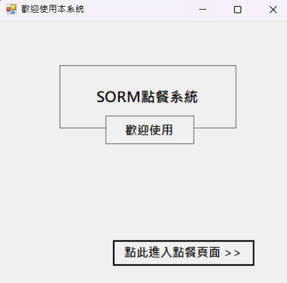
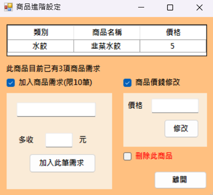
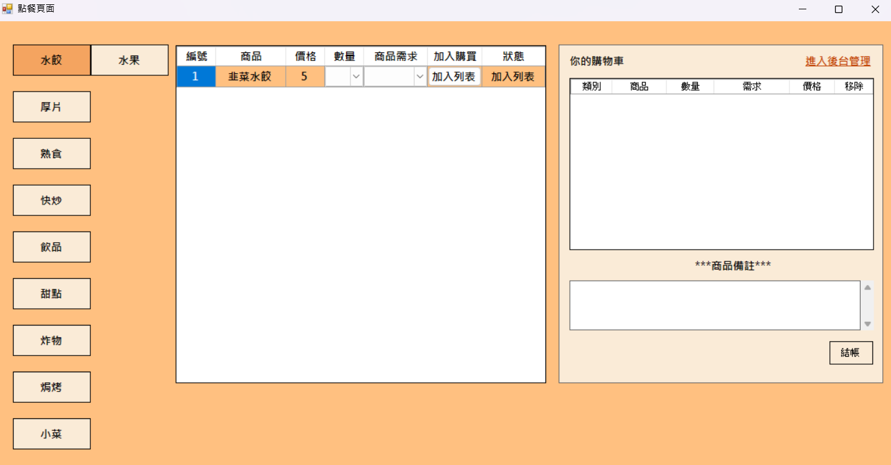
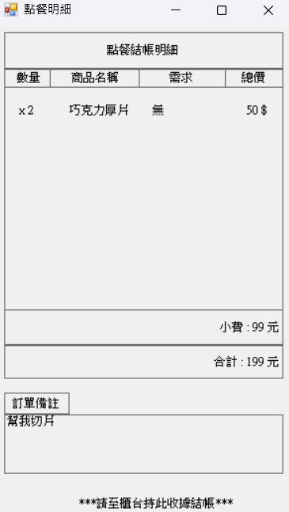

# SORM 點餐系統 C#
組長 : 資工三乙 1110932073 許皓翔 組員1 : 資工三乙 1110932078 游東澄 組員2 : 資工三乙 1110932069 邱海齊

***

S : 商品設定 O : 點餐 R : 結帳明細 M : 商品類別管理 
***
# 表單頁面功能描述  
#### 包含以下表單頁面 :

1. 系統初始進入畫面 2. 點餐介面 3. 商品管理介面 4. 商品明細介面 5. 商品進階設定介面 6. 管理員登入介面 7. 管理員帳號註冊介面

### 系統初始進入介面 : 

***
### 商品進階設定介面 :

### 功能 : 

1. 商品需求設定 2. 商品需求數量限制為最多五個 3. 商品價錢設定 4. 刪除此單一商品

***

### 商品點餐介面 : 

### 功能 : 

1. 所有類別的商品瀏覽和商品狀態 ( 是否被加入購物車 )
2. 加入購物車 
3. 可以在購物車中移除商品，該商品狀態則改變
4. 增加此次訂單的備註

***
### 點餐明細介面 :

### 功能 : 

1. 產生點餐明細
2. 明細中包括 : 商品名稱、價錢、購買數量 、小費 ( 隨機產生 )、商品備註、付款總額

***

### 會員登入頁面 :

***

### 商品管理介面 :

### 功能 : 

1. 新增、刪除單一類別
2. 類別數量限制數量為最多18個
3. 一鍵刪除所有類別
4. 新增單一商品項
5. 商品、類別、商品需求重複的例外處理
6. 在新增商品/類別/商品需求/修改商品價格時會規範輸入的型態(使用正規表達式)
7. 右鍵刪除指定的單一類別
8. 一鍵刪除所有商品
9. 顯示現存的所有類別數量
10. 按下進階設定可以設定商品資訊
11. 在此頁面新增類別時就可以在Form_O中看到剛剛所新增的類別所產生的按鈕

***
ps. 整個專案做完時才發現應該要再多加個可以自行設定商品的購買數量，但發現code許多零碎的地方就要因此重改，顧慮種種風險所以就索性留下對於這個功能的思路 :  
資料庫中Table再該新增一個數量欄位，在Form_M中新增商品項時可以設定，因為dataGridView每次要顯示內容時就去Table抓資料，所以該商品的數量欄位的內容 ( comboBox ) item的數量就會對應到Table中該商品數量欄位的值 2023/5/8

